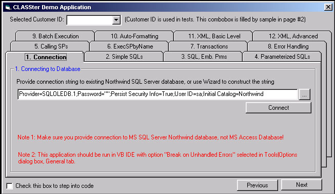



## Database Operation\-Auto Generated Class

### Description

Database Operations Using Automatically Generated Class

This is demo application that demonstrates powerful database functionality of database class automatically generated by CLASSter 2.0. Demo is for MS SQL Server, but CLASSter supports now MS Access, Sybase and Oracle server. Powerful features implemented by class - executing stored procedures, parameterized SQLs, multiple recordsets, batch execution, XML processing. The class code shows full implementation of these features
 
### More Info
 

             |
---                |---
**Submitted On**   |2002-05-09 23:50:32
**By**             |[Nishigandh Sudrik](https://github.com/Planet-Source-Code/PSCIndex/blob/master/ByAuthor/nishigandh-sudrik.md)
**Level**          |Advanced
**User Rating**    |4.8 (29 globes from 6 users)
**Compatibility**  |VB 5\.0, VB 6\.0
**Category**       |[Databases/ Data Access/ DAO/ ADO](https://github.com/Planet-Source-Code/PSCIndex/blob/master/ByCategory/databases-data-access-dao-ado__1-6.md)
**World**          |[Visual Basic](https://github.com/Planet-Source-Code/PSCIndex/blob/master/ByWorld/visual-basic.md)
**Archive File**   |[Database\_O1719203122004\.zip](https://github.com/Planet-Source-Code/nishigandh-sudrik-database-operation-auto-generated-class__1-52322/archive/master.zip)

